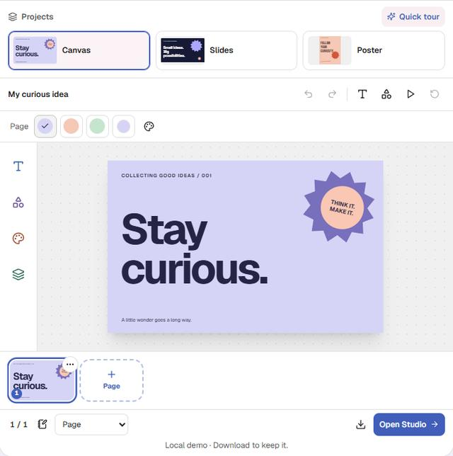

# LEARN takeover checkpoint — 2026-09-30

**Verified local checkpoint:** the slides migration, new navigation, Me/Profile and landing mini Studio have passed their checks and are committed locally. The production build and CSS guards pass. The broader bug, AI and social roadmap remains open below.

Active checkout: `C:/Users/user/Downloads/Projects/LEARN`, branch `cleanup/stage-1`. Latest code checkpoint: **`471633a`**. Six focused code/QA commits are listed below, followed by this documentation checkpoint. No new push or deployment has been made by this takeover.

Continuity: [Claude checkpoint 4](../sessions/2026-09-30.md), [steps 1–2 and owner decisions](../sessions/2026-09-28.md), [Codex resume point](../sessions/2026-09-30-codex-takeover.md), [request ledger](../roadmap/requests.md).

## Checkpoint 4: one editor

| Step | Result | Local commit |
| --- | --- | --- |
| 1. Presentation designs | Slides use the shared editor; opening an old deck converts it and archives the original. Presentation designs appear under Slides. | `0cced60` |
| 2. PowerPoint import | Import retains slide layout, text, pictures, backgrounds, notes and supported formatting. | `356ff92` |
| 3. Tables | Editable cells, rows, columns, header/banded styles, table import and export. | `f95aa4f` |
| 4. Element entrances | Rise, Reveal and Emphasis, previews and automatic entrances in present mode. | `dd69861` |
| 5. Rehearsal and outline | Pausable timer, time estimates, page notes and an Outline `.txt` download. | `aea85b4` |
| 6. Retire the old editor | Notes, Docs and Sheets entry paths open the shared slides editor. Browser drafts and edited converted copies are preserved. | `9950daa` |
| 7. Final report and checks | Migration, UI/demo, TypeScript, full suite, production build and CSS guards passed. Report and resume point saved. | This documentation checkpoint |

The owner chose conversion when an old deck opens, with its original archived, and all four carry-overs: PowerPoint import, tables, element animations, timer and outline export.

The takeover also fixed concurrent draft recovery, clearing a newer draft after an awaited save, lost presenter notes when duplicating a legacy deck, navigation changing an office layout before its save guard, and reopening an archived converted copy overwriting its edits. An existing converted copy now restores without replacing its content; a separate recovered draft is created when needed. Failed draft saves keep the browser draft available.

## Choices and limits to review

### 1. Presentation designs and conversion

- Presentations use 16:9 at 1920×1080 or 4:3 at 1440×1080. Printable, social and custom formats retain their page-stack editor; writing documents retain their writing editor.
- Existing designs in presentation sizes now list as Slides. Add → Canvas asks for a size first; Add → Slides follows the Settings aspect choice.
- Legacy push/wipe transitions become Slide transitions. A whole-slide lock becomes locks on its elements. The ten old slide themes retain their page colours rather than becoming ten named design themes.
- Previously created share links continue to show the original shared deck snapshot. Claude's step 1 log reported that Today's Recent may label a converted deck as Canvas; that label needs a separate follow-up check.

### 2. PowerPoint import

- Unsupported aspect ratios fit and centre within the nearer supported presentation size, with a notice. Fonts map to the nearest available design font.
- Reused pictures upload once, with a limit of 80 pictures. EMF/WMF pictures, charts, SmartArt and animations are omitted with notices.
- Empty PowerPoint placeholders are omitted. The file's title is used when meaningful, otherwise its file name.
- Tables now import as editable tables, superseding the temporary text-only table import described in the earlier step 2 log.

### 3. Tables

- Each cell holds one paragraph. Enter moves down; Enter in the last row ends editing. Tab after the last cell adds a row.
- A corner resize scales the table's type. A rotated table exports to PowerPoint as a picture; cell text stays opaque when the table is transparent.
- Converted legacy tables gain an outer frame. New table grids use the theme's muted colour.
- PowerPoint table import samples header, body and banded-row styles. Individual-cell and first/last-column overrides are not retained. Merged cells split, keeping text in the first cell; imports beyond 30 rows or 10 columns are shortened with notices.

### 4. Animations

- Entrances run automatically in layer order, bottom first, with grouped elements together. Revisiting a page plays them again; on-click builds are not implemented.
- Choosing an entrance previews it. Apply to page affects unlocked elements; None clears their entrances.
- Reduced motion suppresses automatic entrances and selection previews. Explicit Play page still plays the requested preview.
- An old slide animation becomes an entrance on its nonempty elements. PowerPoint import/export does not carry animations.

### 5. Timer and outline

- Estimates count page text and notes at 2.4 words per second, with at least four seconds per page, plus entrance time. Hidden pages are excluded.
- Present mode starts the timer; a click or T pauses/resumes it. The timer turns amber after the estimate. On phones, time is available above the speaker notes instead of in the compact control bar.
- Outline follows the chosen download pages. Text is ordered top-to-bottom, then left-to-right; table rows use `Cell | Cell`; pictures are omitted; empty pages say `(no text)`.

### 6. Legacy entry paths and draft recovery

- Opening an old deck converts it; blanks, templates and copies become presentation designs directly. PowerPoint import from Notes, Docs or Sheets retains layout.
- Explicit 16:9 and 4:3 sizes carry over. Other legacy slide shapes use the Settings aspect choice.
- Unsaved legacy slides become their converted design when it does not already exist, or a separate `… (draft)` design when it does. The rescue notice is now visible in the Studio browser as well as the office workspace.

## New interface changes

| Area | Written change | Verification status |
| --- | --- | --- |
| Sidebar | Four desktop places; Me moves to the bottom profile. Expanded navigation shows the active place's section links. The phone dock retains five places. | Desktop/390/320 pass;22 routes at each width |
| Brand and account | Sidebar brand changes sidebar width without navigation. Profile comes before appearance and notifications. Separate account options use the shared positioned popup with keyboard focus. Red unread numbers stay on their icons. | URL preservation, rail bounds, popup placement, focus and Escape pass |
| Me/Profile | Compact identity, real learning metrics, Shared and Badges sections; editable name, photo, bio, links and privacy. Saves update the account immediately; failures keep edits. | Mocked save failure/success, draft preservation, avatar validation, hidden invalid links and cancel pass |
| Landing mini Studio | Three editable sample projects with real previews, shared selection tools, direct text editing, layers, themes, shapes, pages, notes, history, present mode and PNG download. Project edits and undo histories survive switching between samples. |93 assertions/9 layouts pass in development and the compiled production app |

The mini Studio is a local sample workspace. Its samples do not fetch private account content or write to an account. Download keeps an image; switching to the signed-in Studio does not import the sample edits. It is not a complete asset-upload or cloud-storage demonstration.

## Verification evidence

The migration was verified before its commit. Final UI/demo checks and compilation followed the source fixes, including a stable drag-context identifier to remove the page-strip hydration warning.

| Check | Verified result |
| --- | --- |
| Migration browser probe | **21/21 paths:** seven each at 1280×800, 390×844 and 320×700 |
| Seven paths | Open old deck, rescue unsaved draft, new 4:3 deck, template, duplicate deck, import PowerPoint, Library → Projects → deck |
| Browser safety and layout | API writes intercepted; no real workspace records changed. No uncaught page errors or document overflow in those paths. |
| Targeted migration/API tests | **14/14 passed**, including archived-copy ownership/access, preserved edited content, presenter notes and draft recovery races/failure |
| TypeScript | `node node_modules/typescript/bin/tsc --noEmit`: exit 0 |
| Full automated suite | `ops/run/bin/pnpm.cmd test`: **1,241/1,241 passed**, zero skipped |
| Resource limit | Heavy jobs run sequentially with `NODE_OPTIONS=--max-old-space-size=4096`; Next static-generation workers capped at2 |

Runnable probes: [editor migration](../../scripts/test/editor-migration-probe.ts), [UI takeover](../../scripts/test/takeover-ui-probe.ts), [landing demo runner](../../scripts/test/demo-probe.ts) and its [shared CLI probe](../../scripts/test/playwright-demo.js). Start the local server, then use `node --import tsx ops/scripts/test/demo-probe.ts`. Optional `LEARN_QA_SHOTS=1` saves downscaled captures. The authenticated probes require private `LEARN_QA_STORAGE_STATE`; migration also requires `LEARN_QA_FIXTURES`. These stay outside Git; logs contain no credentials.

### Final verification

| Check | Status/result |
| --- | --- |
| New sidebar/account/profile: desktop,390 and320 |66 route visits and189 assertions pass, plus5 desktop avatar/link/cancel checks. Compiled production repeat:22 routes/61 assertions at320/dark |
| New landing demo |93 assertions,9 Light/Dark/Color layouts at1280/390/320; text/style edits, drag/resize/rotate, history/reset, projects, notes, page add/duplicate/hide, T/Ctrl+Enter, complete/skip tutorial, presentation/timer and PNG verified |
| PNG integrity | Decodes1920x1200 at standard2x quality; two file reads have the same SHA-256 |
| Browser errors and write safety | No uncaught page errors in app probes; no page or console errors in the final demo probe. App mutations mocked; anonymous demo attempted no API writes |
| Final TypeScript after source fixes | Exit0 |
| Final full suite after source fixes |1241/1241 pass, zero skipped |
| Production build and postbuild guards | Exit0;91 pages generated with2 workers; CSS guard passes4 files |
| Git integrity | `git fsck --full` exit0; recoverable dangling objects retained.39 changed files matched committed Git blobs and two SHA-256 reads. No corruption errors reported |
| GitHub | Draft PR#1 still open; Sept27 remote CI/Vercel success is historical, not proof of these unpushed commits. No open GitHub issues |
| Push | Awaiting the owner's checkpoint decision; no new push |

| Local commit | Purpose |
| --- | --- |
| `9950daa` | Retire legacy editor, preserve draft recovery and archived converted work |
| `a9b4a75` | Stable page-strip drag IDs during hydration |
| `3db47b8` | Me/Profile with inline editing and visual progress |
| `de67118` | Sidebar/footer/account/menu consistency |
| `0874581` | Working mini Studio and guided tutorial |
| `471633a` | Browser probes and bounded build workers |

The final build retains existing local Cloudflare Durable Object proxy warnings. Online voice/video, multi-user collaboration and provider connections were not proven by this checkpoint.

## Public demo pictures

These anonymous sample captures are downscaled and committed for review. Original cache files remain preserved; source and copied image SHA-256 values were checked twice.

[390px Light](2026-09-30-demo/demo-390-light.jpg) · [320px Dark](2026-09-30-demo/demo-320-dark.jpg)

## Local visual evidence

These are downscaled JPEGs in ignored `.cache`, for local review only; they are not published assets. Migration captures are capped at 640px wide and profile captures at 720px, without enlarging phone captures.

- [Desktop: Library opens the shared slides editor](../../../.cache/design-review/takeover/migration-1280-library.jpg)
- [390px: PowerPoint import](../../../.cache/design-review/takeover/migration-390-pptx.jpg)
- [320px: Library entry](../../../.cache/design-review/takeover/migration-320-library.jpg)
- [Profile draft: desktop Color mode](../../../.cache/design-review/takeover/profile-1280-color.jpg)
- [Profile draft: 390px Light mode](../../../.cache/design-review/takeover/profile-390-light.jpg)

Migration result records: [1280](../../../.cache/design-review/takeover/migration-1280-all.json), [390](../../../.cache/design-review/takeover/migration-390-all.json), [320](../../../.cache/design-review/takeover/migration-320-all.json). [Demo result](../../../.cache/design-review/takeover/production/demo-results.json) and [production320 UI result](../../../.cache/design-review/takeover/production/takeover-ui-results.json) are local only. The most recent desktop-only UI result includes the5 avatar/link/cancel checks; the earlier consolidated three-width run passed189 assertions.

## Still open

- **Ledger #6 — AI design arrangement:** layout/spec building exists; a reachable configured provider and live end-to-end proof remain open. Unit tests are not proof of online AI.
- **Ledger #7 — resource-saving operation:** this remains a standing optimization goal. Removing the legacy editor does not prove every page's performance or dead-code cleanup is complete.
- **Ledger #8 — chat, voice/video and mini-games:** prior local claims need fresh two-user checks and separate external-network/device verification. This checkpoint does not verify online calls or video.
- **Ledger #16 — remaining bugs:** sheet formulas, Vault markdown, AI tutor labels, import actions, streak/live-answer issues and the recorded bug list remain for the next fix phase.
- Notes ↔ AI ↔ activities and social handoffs (ledger #4–5) remain future work where not already verified. Real calendar account activation and provider round trips remain an external dependency.
- This demo does not add stock-provider connections, MP4 export, generative images or arbitrary PDF-object reconstruction. Existing collaboration capabilities need separate multi-user/network checks.

Older completion reports are historical evidence, not a replacement for the current ledger. This checkpoint is complete locally; await the owner's push and next-checkpoint decisions before publishing or starting the later roadmap.
