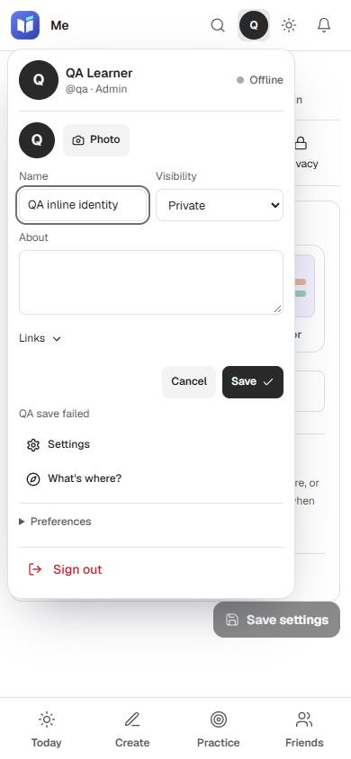
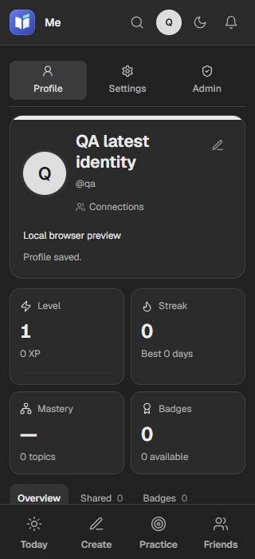

# Account, Add and atomic writes — 2026-10-01

Status: verified and pushed in six focused commits at `737c78a`; this delivery receipt follows. Earlier26 verified commits are preserved on the same branch.

The account avatar now owns the profile editor, preferences and account actions. The duplicate account ellipsis and primary phone profile destination are removed. The direct profile route and Settings use the same identity form. Failed drafts survive closing the panel and switching its desktop/phone placement; saves update all surfaces. A per-user browser lease prevents overlapping identity/settings writes, and newer identity changes survive a delayed public-profile response.

Settings has validated section links and one reachable Save settings footer. Its narrow save preserves identity and links, updates the signed-in user and persists the displayed review policy. The scheduler also reads older nested workspace preferences; zero-dose and maximum-dose settings survive browser serialization. Fresh browsers hydrate saved workspace options; existing local choices retain precedence. The previously published preferences endpoint remains for already-loaded clients.

Shared Add now opens the actual creator or setup flow for all seven kinds. Transient intents are consumed before creation, so refresh and Back cannot replay a creation request. Quiz setup reloads correctly inside AI, and completed creation/import requests cannot navigate back after leaving Studio. Practice uses its existing section tabs with one compact Review shortcut. Editor options are single-line actions; section help uses a bounded shared popover with keyboard focus return.

Live answers now compare the stored state and commit dependent roster/answer writes in a D1 batch. Review grading reserves the daily slot and commits the card, XP and audit changes in one batch. Uncertain responses are surfaced rather than replayed; confirmed comparison misses may retry. Attaching chat preserves concurrent joins. Finished-game result, thread timestamp and audit writes are idempotent, and a host retry repairs publication and wakes the chat again.

## Evidence

- Independent source reviews completed for account focus/draft coordination, all seven Add paths and atomic mutation paths.
- Final full suite **1,328/1,328** and production build/4 CSS checks pass. Atomic SQLite/D1 checks **31/31**, corrective checks **35/35**, additional scheduling **4/4** and real Settings review-cap API checks **8/8** pass.
- Anonymous public audit **48 layouts/76 interactions**, Studio demo **93 checks/9 layouts** and existing compiled regression **123 assertions** pass. Final compiled account/Add/Settings probe passes **66page visits/346interactions** at1280/color,390/light and320/dark, with zero page errors or unexpected writes. [Detailed results](2026-10-01-account-and-atomic-writes/takeover-ui-results.json).
- Browser probes intercept writes and use isolated fixtures. Public demo/auth checks block unmatched writes. No real profile or project data is changed.

- Sequential pinned Node24.15/4096MB verification: `ops/run/bin/pnpm.cmd test`, `ops/run/bin/pnpm.cmd build`, `node --import tsx ops/scripts/test/takeover-ui-probe.ts`, and local `smoke-cloudflare.ts`. No concurrent heavy jobs.
- Public/demo/regression checks ran against the preceding compiled build; their source is unchanged by the final Settings-only changes. [Public results](2026-10-01-account-and-atomic-writes/public-results.json), [demo results](2026-10-01-account-and-atomic-writes/demo-results.json), [regression results](2026-10-01-account-and-atomic-writes/results.json).
- Demo PNG export decoded1920x1200; no writes/errors. Screenshots are anonymous and downscaled. Original/copied evidence hashes were read twice and match [the receipt](2026-10-01-account-and-atomic-writes/evidence-hashes.json). All58 checkpoint files also matched two SHA-256 reads and committed Git bytes; `git fsck --full` passed twice. [Committed checkpoint receipt](2026-10-01-account-and-atomic-writes/code-737c78a-hashes.json). Remote/local737c78a matched. Latest CI status is linked in the session delivery receipt.

## Pictures

## Boundaries

- The profile save lease coordinates editors in one browser runtime; it is not server versioning across tabs or devices.
- Game completion and chat publication remain separate transactions. A host retry repairs publication; there is no durable background outbox. Notifications are at-least-once and realtime delivery is best-effort.
- Browser fixtures do not verify production credentials, calendar providers or online calls. Existing local Cloudflare Durable Object proxy warnings remain separate from UI checks.
- Prior reports remain historical snapshots. This report supersedes the earlier live-answer/review-budget concurrency items; broader AI/social verification and adaptive scheduling remain open.

Recovery: [current session log](../sessions/2026-10-01-continuation.md).
