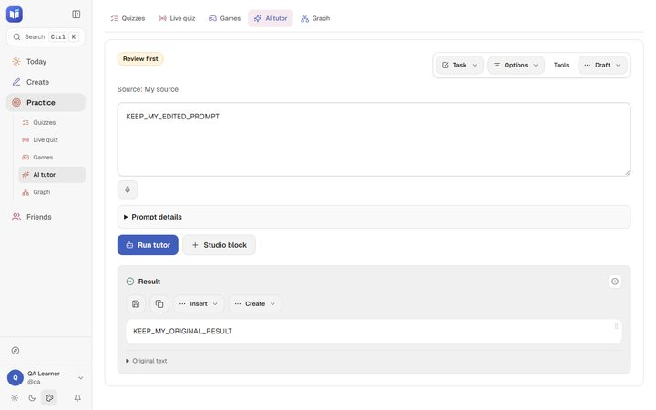
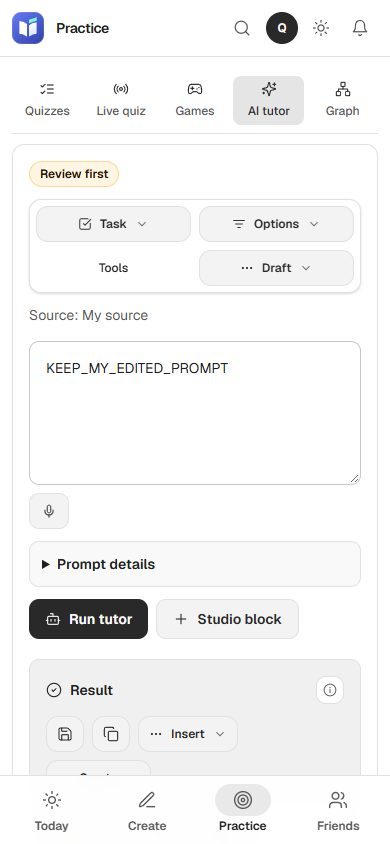
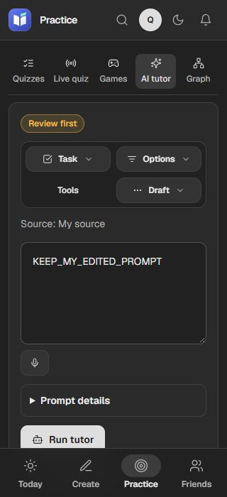

# Compact AI workspace — 2026-10-01

Status: **verified and pushed** through `a1ff56e` on `cleanup/stage-1`. [Exact-head CI passes](https://github.com/SethyPagna/LEARN/actions/runs/36810726142).

## Change

- Advanced configuration has one Options entry; provider diagnostics remain in the on-demand Tools panel. Recovery and Reset live in Draft.
- Task, Options, Draft, Insert and Create use the shared anchored popover and one open-menu state. Menus support keyboard entry, Escape/focus return and outside clicks.
- Task switches, Reset, Studio block, result continuations and import follow-ups archive the outgoing draft and persist the replacement before applying it. Failed writes retain the current prompt/result. Previous draft restores intentionally empty strings as well as source/context fields.
- Context options use two columns; the phone header uses two balanced rows and a short Task label. The main action retains a visible label and existing request/source/owner/pending guards.

## Evidence

The compiled baseline at `8b938f8` reproduced the task-switch defect: an immediate edit was replaced without being archived, while its old result stayed visible. The first probe used a wrong exact accessible name for Quiz; after correcting the selector, the baseline reproduced with no real API writes.

- Full TypeScript: pass (`pnpm lint`).
- Full suite: 1,355/1,355 pass, no skips, 48.9 seconds (`pnpm test`) before the final two layout-only props. Final build includes TypeScript checking.
- Final production build and all four CSS checks: pass (`pnpm build`).
- Final compiled AI browser matrix: **312/312** pass across all three themes at 1280, 390 and 320 pixels. [Results](2026-10-01-ai-workspace/results.json). Covers balanced rows and visible Task label, menu bounds, keyboard switching, focus/Escape/outside, immediate edits, reload recovery, both storage failure points, empty fields and delayed generation. No page errors or unexpected writes.
- Updated Notes/Vault regression: **108/108** pass. [Results](2026-10-01-ai-workspace/learning-results.json). The final two layout props were checked by the AI matrix afterward.
- Older AI regression: **18/18** pass on final source with provider-unavailable fixtures. [Results](2026-10-01-ai-workspace/older-probe-results.json).
- Independent source review found empty-string fallback and independently opened result menus. Both corrections were applied and re-reviewed. Source review does not establish rendered behavior.

Root and independent rendered review inspected downscaled screenshots; Task discoverability and the lone phone Draft row were corrected and checked in the final browser matrix. Ten copied evidence files match two original reads and two copied reads. [Evidence hashes](2026-10-01-ai-workspace/evidence-hashes.json).

Three focused commits delivered the tutor menus/recovery, phone layout and operational verification evidence. All 20 changed files at `a1ff56e` match two SHA-256 reads and committed Git bytes. [Code hashes](2026-10-01-ai-workspace/code-a1ff56e-hashes.json). `git fsck --full` passes twice; recovery objects were preserved. Local HEAD, two remote reads and the independent GitHub commit API agree. CI independently passes install, tests, type check and production build on that revision. This delivery receipt is the next documentation commit; no merge or manual deployment was performed.

Raw local logs and probe artifacts: `.cache/design-review/ai-workspace-*` and `.cache/design-review/ai-workspace/`. Operational probe: `ops/scripts/test/ai-workspace-probe.ts`.

## Pictures

## Limits

All browser API traffic is intercepted in isolated contexts; live provider credentials, backend writes and external integrations are not verified. The existing draft schema retains source, task and prompt configuration; token budget, temperature and include-notes stay shared workspace preferences. Prior generation failures clearing a displayed result are a separate follow-on. Browser storage remains browser-global and is not atomic across tabs; a hard close cannot preserve edits when storage is unavailable.

Recovery: [session log](../sessions/2026-10-01-ai-workspace.md). Prior delivery: [learning workflow](2026-10-01-learning-workflow.md).
