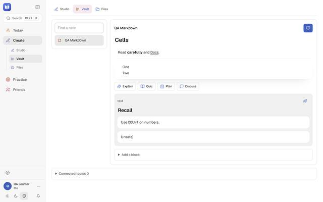
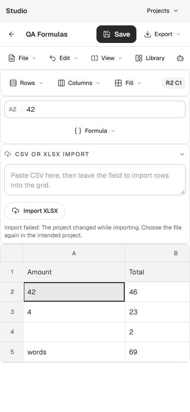
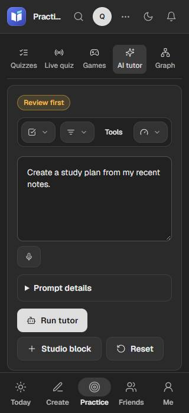

# LEARN bug-fix checkpoint — 2026-10-01

**Newer evidence:** earlier verified work was pushed at `e97a801`. [Account/Add/atomic follow-up](2026-10-01-account-and-atomic-writes.md) verifies the live-answer and daily-budget race corrections. The original checkpoint and its then-open limitations below are preserved.

The next bug-fix checkpoint is verified locally. TypeScript, all 1,293 tests, the production build, 4 CSS checks and 123 browser assertions pass. The broader AI/social roadmap and the concurrency limits below remain open. Nothing was pushed or deployed.

Checkout: `C:/Users/user/Downloads/Projects/LEARN`, branch `cleanup/stage-1`. Code/QA ends at `28d2a47`, followed by the documentation checkpoint. Resume from [the session log](../sessions/2026-10-01-codex-fixes.md); previous editor/demo work is preserved in [September 30's report](2026-09-30-takeover.md).

## What changed

| Area | Result | Local commit |
| --- | --- | --- |
| Studio | Cached formula dependencies, computed cells and previews; blanks/text ignored; cycles and work bounded. Focused phone cells clear sticky row numbers. Compact imports cannot overwrite newer edits or a changed project. | `45670aa` |
| Vault | Notes and saved blocks render safe Markdown; code stays literal; read-only previews have no drag handles. One stylesheet serves all blocks, with bounded fallback for malformed/deep HTML. | `b9aa364` |
| Reviews | Reads no longer create cards. Today and Reviews share the remaining daily budget/rest day; stale grades are refused; streaks read persisted fields. | `2da530c` |
| Quiz privacy | Owned/admin/shared-bank lists; permission checks on direct reads, attempts and hosting retain existing sharing rules. | `c4b2fa3` |
| Live quizzes | Replaying a quiz keeps separate session rosters/answers. Missing stored answers recover on an accepted mutation; direct entry waits for authentication, and hosts remain hosts. | `c5b4750` |
| Read-only data | Archived notes stay out of the dashboard. Achievement reads stop creating placeholders; existing records remain. | `bd8bc6a` |
| AI controls | Concise visible labels for primary actions. | `1a73c80` |
| Phone chat | Remembered conversations open after reload. | `b23088f` |
| Titles/smoke | Direct routes retain their section titles; smoke checks match the current home/login and CSS. | `4f10d94` |
| QA/resources | Reproducible isolated Playwright checks; test files run one at a time. | `28d2a47` |

## Visual evidence

All pictures use anonymous fixtures. They were downscaled before inspection. The import notice shows an intentional rejection after a newer edit; the cell still contains 42.

## Verification

- Pinned Node 24.15.0, heap 4096 MB; builds, type checks and full suites ran sequentially.
- `node node_modules/typescript/bin/tsc --noEmit`: exit 0.
- `ops/run/bin/pnpm.cmd test`: 1,293 passed, 0 failed/skipped. Final repeat after phone focus/title changes: 61.9s.
- `ops/run/bin/pnpm.cmd build`: exit 0; 91 routes, 2 static-generation workers; postbuild CSS guards pass for 4 files.
- `node --import tsx ops/scripts/test/bugfix-ui-probe.ts`: 123 assertions, 41 per layout at 1280/color, 390/light and 320/dark. Formula editing/dependencies, failed and delayed import recovery, safe Vault rendering, AI labels, remembered chats, direct player/host/stale-code entry and route titles pass. No uncaught/caught React errors or unintended writes. [Detailed results](2026-10-01-bugfixes/results.json).
- `LEARN_SMOKE_BASE_URL=http://localhost:3000 node --import tsx ops/scripts/test/smoke-cloudflare.ts`: local production smoke passes.
- SQLite-backed live tests exercise the actual migration schema and uniqueness constraints; API tests cover owner/admin/shared quiz grants, review caps/rest/stale grades, archive filtering and read-only empty collections.
- Three independent source reviews completed. The first browser attempt exposed two probe setup errors, corrected before the passing run. Downscaled visual review then exposed the focused-cell overlap, repaired and reverified in the compiled app.
- Two `git fsck --full` runs pass. Source/evidence SHA-256 values were read twice; committed source bytes and copied evidence were compared independently. Originals and local D1/R2 state are preserved.

The probe mocks every API response, aborts unexpected mutations and uses a fresh browser context. It does not verify provider credentials, real user saves or online calls. Known local Cloudflare Durable Object proxy warnings remain; they are not proof of working online realtime/calls. Remote CI is still for the earlier remote head, not these local commits.

## Defaults and unfinished work

- Formulas support the five existing reference/range aggregates: SUM, AVERAGE, MIN, MAX and COUNT. No arithmetic/nested functions/literal arguments; display rounds to two decimals, while dependencies retain precision. Calculation has work/depth limits.
- Vault supports basic headings, lists, inline styling/code and safe links. It is a bounded preview, not full CommonMark: 40,000 source characters and 400 blocks, with truncation notices.
- Pending DOCX/XLSX imports require retry after edits/project changes. The workbook race was browser-tested; DOCX uses the reviewed matching guard but has no separate browser race case here.
- Reviews retain 1/2/4/7-day rating intervals and UTC days. Due dates move off the selected rest day. Cap defaults to 30, maximum 200; due backlog counting is bounded by 200 fetched cards. This is not an adaptive/FSRS scheduler.
- **Review concurrency remains:** two simultaneous grades on different cards can both use the final daily slot; there is no atomic budget reservation.
- **Live concurrency remains:** simultaneous answers in one session can race the JSON state update. Session identity/replay persistence is fixed; atomic live scoring is not established. Finished legacy sessions are preserved rather than repaired automatically.
- Shared-viewer quizzes can open by permitted ID but remain outside the owned/shared-bank collection list. Existing seeded cards/achievements are retained.

Next recommended checkpoint: atomic live-answer persistence and review-budget reservation, then the chosen Notes ↔ AI ↔ activities and chat/calls/game roadmap. Push stays pending under the [owner's checkpoint rule](../roadmap/requests.md#standing-rules).
