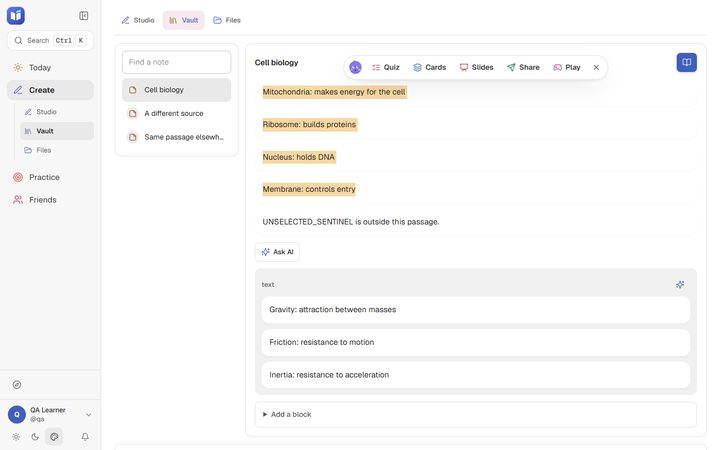
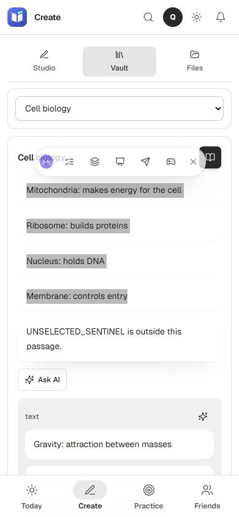
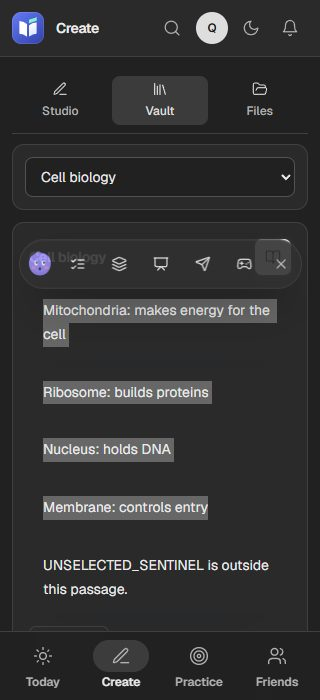

# Notes and Vault activities — 2026-10-01

Status: verified and pushed in four focused commits through `9721e2e`. [Exact-head GitHub CI passed](https://github.com/SethyPagna/LEARN/actions/runs/36807013394); this delivery receipt follows.

Selecting a passage in Vault now offers the same compact quiz, cards, slides and chat tools as Studio. Whole-note AI actions share one Ask AI menu. Studio Ask AI uses the selected excerpt when one belongs to the active item. Source handoff waits for the outgoing editor's save guard before writing a preset.

Selection tools close when their source is removed or changed. Cancelled or stale work cannot start subsequent requests or navigate back into a departed source. Resource caches belong to an account; synchronous duplicate clicks cannot start duplicate work. A failed live-host request reuses its saved quiz on retry. Oversized selections use capped plain text, without cloning their unbounded HTML. Fast selections after cancellation are refreshed, and dismissal applies to the source where it occurred.

Vault block drafts persist separately per note, including type and revision. Failed saves keep the text; a late completion cannot clear a newer observed revision. AI source handoff archives the outgoing prompt and reply; Previous draft restores them. Draft storage failure blocks controlled navigation, and recovery retries the write. Generation, import and insert requests keep their original context, so late responses cannot replace newer input or navigate after leaving.

Creating the same review cards again updates their content while preserving card IDs, schedules, learned statistics, metadata and review history. AI prompt/answer identities survive reordering and title changes. Older randomly identified AI cards are reused without deleting existing duplicates. Card writes and their audit entry commit atomically. Requests above 40 cards fail before writing; this bounded batch leaves room under the current [D1 invocation limits](https://developers.cloudflare.com/d1/platform/limits/). Ambiguous local quiz solutions and AI choices that collide after normalization/truncation are rejected.

## Verification

- Independent source reviews covered selection ownership, guarded handoff, draft recovery, bounded atomic persistence and legacy adoption. Review findings were corrected before delivery.
- Full TypeScript check passes. Final full test suite: **1,355/1,355**, zero failures/skips;53.9seconds. SQLite tests exercise grade → repeat creation, old AI identities, user isolation, simultaneous saves, failed rows/audits, uncertain committed responses and40/41card boundaries.
- Compiled browser probe uses isolated API fixtures. Every browser API request is intercepted; unexpected mutations abort. No real notes, account data or AI providers are changed or invoked.
- Final production build and four CSS checks pass. Compiled browser pass: **108/108**, at 1280/color, 390/light and 320/dark; zero page errors or unexpected writes, including identical-passage keyboard source switching. [Detailed results](2026-10-01-learning-workflow/results.json).
- Checks include selected-only content, local destination flows, keyboard focus, source removal, cancellation, duplicate clicks, failed host retry, failed saves, draft round trips, refused storage writes, late AI insert/generation and capped HTML tails. Toolbar bounds and page widths are asserted.
- All 20 code/test files match two SHA-256 reads and their committed Git bytes. [Code receipt](2026-10-01-learning-workflow/code-d1c748a-hashes.json). All seven copied browser evidence files match two original reads and two copy reads. [Evidence receipt](2026-10-01-learning-workflow/evidence-hashes.json). `git fsck --full` passes twice; existing unreachable recovery objects are preserved.
- All 35 code/evidence/checkpoint files at `9721e2e` also match two working reads and committed Git bytes. [Checkpoint receipt](2026-10-01-learning-workflow/code-9721e2e-hashes.json). Local HEAD, two `ls-remote` reads and the independent GitHub commits API agree. No merge or deployment was performed.

## Pictures

Downscaled screenshots use isolated test content. The desktop and two phone layouts were visually inspected.

## Boundaries

- An already-started server write may finish after cancellation; follow-up work and stale navigation are prevented. Uncertain responses are surfaced rather than automatically replayed.
- Browser fixtures and SQLite transactions do not verify live provider credentials, deployed D1, calendar connections, online calls or chat delivery. Local Cloudflare proxy warnings remain separate.
- Source-specific review-card provenance is a follow-on. Existing global prompt/answer reuse and legacy IDs are preserved; old duplicate rows are not removed.
- Draft revisions protect observed newer edits; browser storage is not an atomic cross-tab store. Hard reload/close cannot recover text if storage stays unavailable. Legacy AI draft keys remain browser-global.
- Previous draft exposes the last outgoing snapshot; the retained archive has no full history browser yet.

Recovery: [session log](../sessions/2026-10-01-learning-workflow.md). Historical account/landing/editor delivery: [previous receipt](2026-10-01-account-and-atomic-writes.md).
